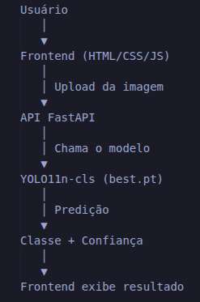
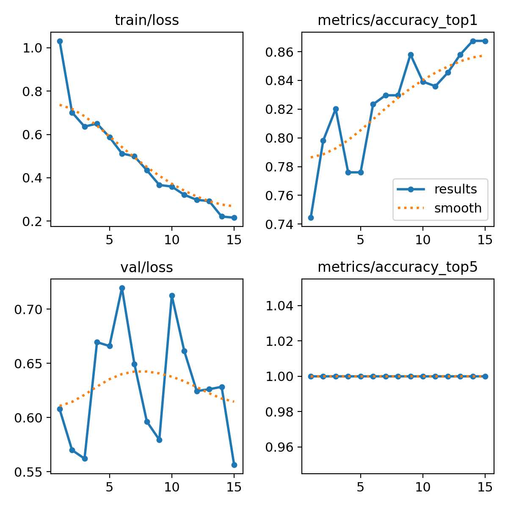
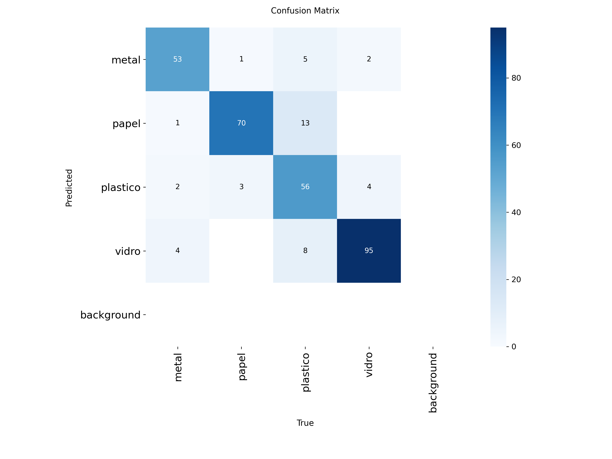

# ♻️ Classificador Inteligente de Recicláveis com YOLO11

## Integrantes

* Alex Junio Constantino
* Caio David Souza Coutinho
* Felipe Barretos

---

## Descrição

Aplicação de Visão Computacional desenvolvida para classificação automática de resíduos recicláveis utilizando o modelo YOLO11 para classificação de imagens.

O sistema identifica quatro categorias de materiais:

* Papel
* Plástico
* Metal
* Vidro

A aplicação possui uma interface web própria e uma API desenvolvida em FastAPI para realizar as inferências do modelo treinado.

---

## Tema Escolhido

### Triagem Automática de Recicláveis

A aplicação auxilia na separação e identificação de materiais recicláveis, podendo ser utilizada em processos de coleta seletiva, educação ambiental e automação de triagem.

### Tarefa do YOLO

Classificação de Imagens (Classification)

---

## Modelo Utilizado

### Modelo Base

YOLO11n-cls.pt

### Justificativa

Foi escolhida a variante Nano (n) por apresentar:

* Menor consumo de memória
* Menor tempo de treinamento
* Boa precisão para o problema proposto
* Compatibilidade com computadores sem GPU dedicada

---

## Dataset

### Origem

Dataset adaptado a partir da base pública TrashNet.

### Classes Utilizadas

| Classe   |
| -------- |
| Papel    |
| Plástico |
| Metal    |
| Vidro    |

### Quantidade de Imagens

| Classe   | Train | Val |
| -------- | ----- | --- |
| Papel    | 520   | 74  |
| Plástico | 400   | 82  |
| Metal    | 350   | 60  |
| Vidro    | 400   | 101 |

### Total

* Treino: 1670 imagens
* Validação: 317 imagens
* Total Geral: 1987 imagens

### Split Utilizado

* Treino: aproximadamente 84%
* Validação: aproximadamente 16%

---

## Tecnologias Utilizadas

### Back-end

* Python
* FastAPI
* Ultralytics YOLO11

### Front-end

* HTML5
* CSS3
* JavaScript

### Processamento de Imagem

* OpenCV
* Pillow

---

## Arquitetura

Interface Web → API FastAPI → Modelo YOLO11 → Resultado da Classificação



---

## Endpoints da API

### GET /

Retorna a interface principal da aplicação.

### POST /predict

Recebe uma imagem enviada pelo usuário e retorna:

Exemplo:

```json
{
  "classe": "plastico",
  "confianca": 97.35
}
```

---

## Treinamento

### Parâmetros Utilizados

* Modelo: YOLO11n-cls
* Epochs: 15
* Batch Size: 8
* Image Size: 160
* Device: CPU

### Hardware

* Notebook Lenovo IdeaPad S145
* 8 GB RAM
* Processador Intel

---

## Gráficos




---

## Estrutura do Projeto

```text
reciclador-yolo/
│
├── dataset/
├── model/
├── uploads/
├── static/
├── templates/
│
├── api.py
├── train.py
├── requirements.txt
└── README.md
```

---

## Como Executar

### Criar ambiente virtual

```bash
python3 -m venv venv
source venv/bin/activate
```

### Instalar dependências

```bash
pip install -r requirements.txt
```

### Executar aplicação

```bash
uvicorn api:app --reload
```

### Acessar

http://127.0.0.1:8000

---

## Modelo Treinado

O arquivo do modelo treinado encontra-se em:

```text
model/best.pt
```
